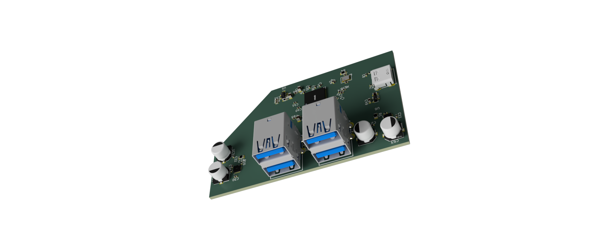
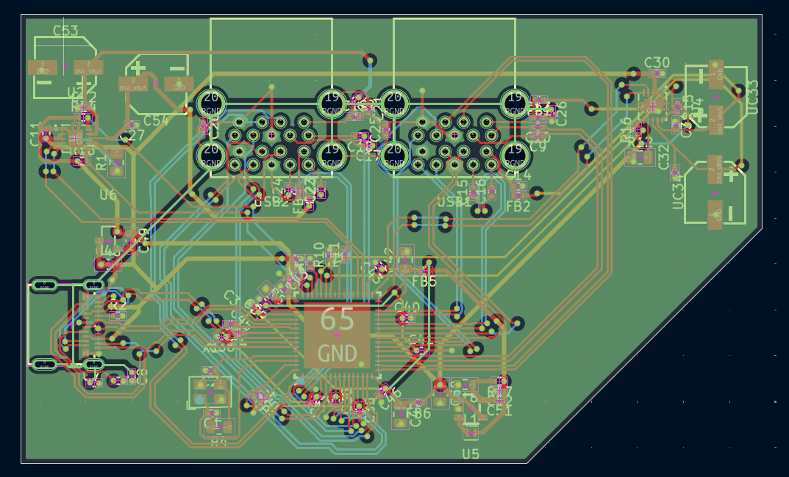
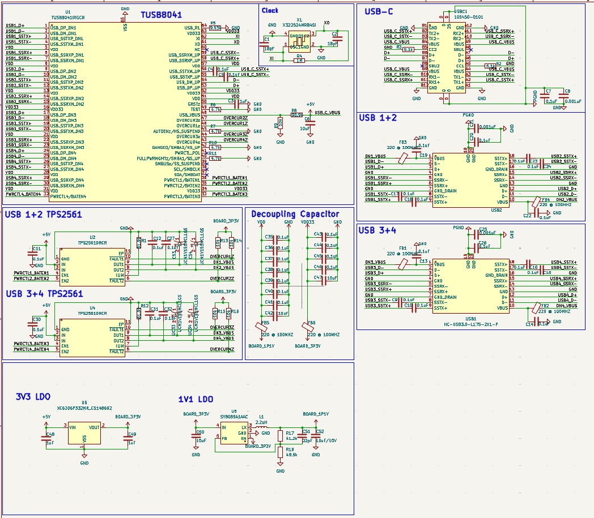

# HighSpeedUSBHub

I looked at an old USB 2.0 hub I made and though what if I could make a faster one? So I did(whether it works or not is another story). This started right after I discovered the [texas instruments](https://www.ti.com/) site via the guide for making a flight controller by @notaroomba.

This is a USB 3.1 hub which uses a usb 3.1 gen 2 upstream port to 4 usb 3.0 downstream ports via a [`TUSB8041`](https://www.ti.com/product/TUSB8041). Each USB stack (I used x2 stacked usb 3.0 ports as they were more compact, and they reminded me of the raspberry pi 4) is powered by a [`TPS2051B`](https://www.ti.com/product/TPS2051B) which is a power switch that has a power limit of around 1A per controller as I recall.

### Features
- 4 USB-A 3.0 downstream ports
- 1 USB-C 3.1 gen 2 upstream port
- Powered by the USB-C port (5V 3A)
- Each downstream port is limited to 1A of current and with equal load across each port, 0.5A per port.
- CRYSTAL 24MHz clock for the TUSB8041

### Getting Started
So ummm, how do I put this...

_*YOU PLUG IT IN*_

### BOMs
- [BOM](./assets/BOM.csv)
- [PCB BOM](./assets/PCB_BOM.csv)